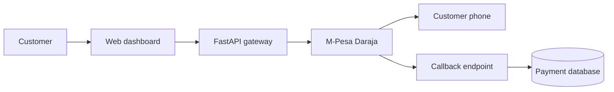

# M-Pesa Payment Gateway

A production-structured FastAPI demonstration of M-Pesa STK Push initiation, asynchronous callback processing and transaction tracking. Simulation mode makes the complete payment flow demonstrable without live credentials.

## What this project demonstrates

- REST API design with OpenAPI documentation
- Kenyan phone-number normalization and request validation
- M-Pesa Daraja sandbox integration structure
- Asynchronous payment state transitions
- Callback authentication for the simulated flow
- SQLite persistence and transaction history
- Unit and integration testing with pytest
- Docker containerization and health checks
- CI with GitHub Actions
- Responsive browser dashboard

## Architecture



## Run locally

```bash
python3 -m venv .venv
source .venv/bin/activate
pip install -r requirements-dev.txt
uvicorn app.main:app --reload
```

Open:

- Dashboard: http://127.0.0.1:8000
- API documentation: http://127.0.0.1:8000/docs
- Health check: http://127.0.0.1:8000/api/health

## Run tests

```bash
pytest --cov=app --cov-report=term-missing
```

## Run with Docker

```bash
docker compose up --build
```

## API endpoints

| Method | Endpoint | Purpose |
| --- | --- | --- |
| `GET` | `/api/health` | Service health check |
| `POST` | `/api/payments/stk-push` | Initiate an STK Push |
| `GET` | `/api/payments` | List recent transactions |
| `GET` | `/api/payments/{id}` | Retrieve transaction status |
| `POST` | `/api/payments/callback` | Receive a Daraja callback |
| `POST` | `/api/payments/demo-callback` | Complete a simulated payment |

## Example request

```bash
curl -X POST http://127.0.0.1:8000/api/payments/stk-push \
  -H "Content-Type: application/json" \
  -d '{"phone_number":"0712345678","amount":100,"account_reference":"INV-1001","description":"Demo payment"}'
```

## Real Daraja sandbox configuration

Copy `.env.example` to `.env`, set `SIMULATION_MODE=false`, then provide the sandbox consumer key, consumer secret, passkey, shortcode and a public HTTPS callback URL. Keep all secrets outside source control.

## Security decisions

- Credentials come from environment variables.
- Pydantic validates amounts, references and Kenyan phone numbers.
- API errors do not expose provider credentials or internal exceptions.
- Callback comparison uses constant-time token checking in simulation mode.
- Payment records retain status history fields for reconciliation and auditing.
- Production deployments should add an API gateway, rate limits, TLS enforcement, centralized secrets, network allowlists and structured audit logs.

## Interview demonstration

1. Open the dashboard and submit a payment.
2. Show the `PENDING` transaction.
3. Select **Complete** to simulate the asynchronous M-Pesa callback.
4. Show the generated receipt and `COMPLETED` status.
5. Open `/docs` to demonstrate the REST contract.
6. Open the test and CI files to explain quality controls.

## Disclaimer

This is an educational demonstration. It is not affiliated with Safaricom and must not process real customer payments without approved Daraja credentials, controls and production onboarding.
