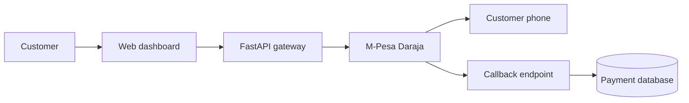

# M-Pesa Payment Gateway

A production-structured FastAPI demonstration of M-Pesa STK Push initiation, asynchronous callback processing and transaction tracking. Simulation mode makes the complete payment flow demonstrable without live credentials.

## Live demonstration

| Resource | Link | Use |
| --- | --- | --- |
| Working application | [mpesa-payment-gateway.onrender.com](https://mpesa-payment-gateway.onrender.com) | Submit and complete simulated M-Pesa payments |
| Interactive API documentation | [Swagger UI](https://mpesa-payment-gateway.onrender.com/docs) | Inspect and exercise every REST endpoint |
| Visual product showcase | [mpesa-payment-gateway-demo.onrender.com](https://mpesa-payment-gateway-demo.onrender.com) | Present the polished payment-console concept |

> The working application uses simulated transactions and never requests an actual M-Pesa PIN. Render's free service can take a short time to wake after inactivity, and its SQLite demo records can reset when the instance restarts.

## What this project demonstrates

- REST API design with OpenAPI documentation
- Kenyan phone-number normalization and request validation
- M-Pesa Daraja sandbox integration structure
- Asynchronous payment state transitions
- Idempotency-key protection against duplicate payment requests
- Payment cancellation and simulated refund workflows
- Status filtering, reference search, analytics and CSV export
- Callback authentication for the simulated flow
- SQLite persistence and transaction history
- Unit and integration testing with pytest
- Docker containerization and health checks
- CI with GitHub Actions
- Responsive browser dashboard

## Architecture



## Run locally

```bash
python3 -m venv .venv
source .venv/bin/activate
pip install -r requirements-dev.txt
uvicorn app.main:app --reload
```

Open:

- Dashboard: http://127.0.0.1:8000
- API documentation: http://127.0.0.1:8000/docs
- Health check: http://127.0.0.1:8000/api/health

## Run tests

```bash
pytest --cov=app --cov-report=term-missing
```

## Run with Docker

```bash
docker compose up --build
```

## Deploy to Render

The repository includes `render.yaml` for a repeatable free-tier Docker deployment. In Render, create a Blueprint from this repository or create a Docker web service with these settings:

| Setting | Value |
| --- | --- |
| Branch | `main` |
| Region | `Frankfurt` |
| Plan | `Free` |
| Health check | `/api/health` |
| Simulation | `SIMULATION_MODE=true` |
| Demo database | `DATABASE_PATH=/tmp/payments.db` |

## API endpoints

| Method | Endpoint | Purpose |
| --- | --- | --- |
| `GET` | `/api/health` | Service health check |
| `POST` | `/api/payments/stk-push` | Initiate an STK Push |
| `GET` | `/api/payments` | List recent transactions |
| `GET` | `/api/payments/stats` | Return payment totals and success rate |
| `GET` | `/api/payments/export.csv` | Export transactions as CSV |
| `GET` | `/api/payments/{id}` | Retrieve transaction status |
| `POST` | `/api/payments/{id}/cancel` | Cancel a pending transaction |
| `POST` | `/api/payments/{id}/refund` | Refund a completed simulated transaction |
| `POST` | `/api/payments/callback` | Receive a Daraja callback |
| `POST` | `/api/payments/demo-callback` | Complete a simulated payment |

## Example request

```bash
curl -X POST http://127.0.0.1:8000/api/payments/stk-push \
  -H "Content-Type: application/json" \
  -d '{"phone_number":"0712345678","amount":100,"account_reference":"INV-1001","description":"Demo payment"}'
```

## Real Daraja sandbox configuration

Copy `.env.example` to `.env`, set `SIMULATION_MODE=false`, then provide the sandbox consumer key, consumer secret, passkey, shortcode and a public HTTPS callback URL. Keep all secrets outside source control.

## Security decisions

- Credentials come from environment variables.
- Pydantic validates amounts, references and Kenyan phone numbers.
- API errors do not expose provider credentials or internal exceptions.
- Callback comparison uses constant-time token checking in simulation mode.
- Payment records retain status history fields for reconciliation and auditing.
- Production deployments should add an API gateway, rate limits, TLS enforcement, centralized secrets, network allowlists and structured audit logs.

## Demonstration walkthrough

1. Open the [working dashboard](https://mpesa-payment-gateway.onrender.com) and submit a payment using `0712345678`.
2. Explain that validation normalizes the number to `254712345678` and stores a `PENDING` transaction.
3. Select **Complete** to simulate Safaricom's asynchronous callback.
4. Show the generated receipt and `COMPLETED` status.
5. Open the [Swagger documentation](https://mpesa-payment-gateway.onrender.com/docs) to demonstrate the REST contract.
6. Open `tests/` and `.github/workflows/ci.yml` to explain automated quality controls.
7. Filter the transactions, export CSV, cancel a pending payment and refund a completed payment.

### Two-minute technical summary

- **API:** FastAPI validates requests with Pydantic and publishes an OpenAPI contract.
- **Integration:** `MpesaGateway` separates the simulated flow from the Daraja sandbox implementation.
- **Persistence:** SQLite tracks checkout IDs, payment status, callbacks and receipts.
- **Testing:** pytest covers validation, API health, STK Push initiation, callback security and state transitions.
- **Delivery:** GitHub Actions runs tests and builds the Docker image; Render hosts the public demonstration.
- **Security:** secrets use environment variables, demo callbacks require a token, and errors avoid leaking provider details.

## Documentation

- [Build the project from scratch](docs/BUILD_FROM_SCRATCH.md)
- [Demo guide](docs/DEMO_GUIDE.md)

## Disclaimer

This is an educational demonstration. It is not affiliated with Safaricom and must not process real customer payments without approved Daraja credentials, controls and production onboarding.
